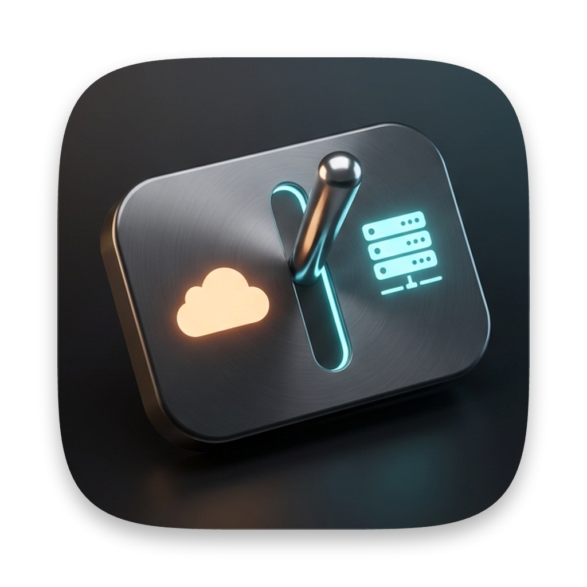

# ClaudeSwitch



A macOS menu bar utility that flips **Claude Code — both the desktop app and the CLI** — between
the Anthropic cloud and a self-hosted model behind an OpenAI/Anthropic-compatible gateway, on
demand. One click, no dotfile editing, no relaunching a terminal to pick up an export.

Built for a LiteLLM gateway fronting a vLLM box, but the profile is fully editable — any gateway
that speaks the Anthropic Messages API works.

## Why a menu bar app and not a shell alias

Claude Code Desktop is a GUI app. It does not inherit your login shell, so `export
ANTHROPIC_BASE_URL=…` in `~/.zshenv` reaches the CLI and nothing else. The one place that reaches
both is the `env` block in `~/.claude/settings.json`, which Claude Code reads at launch and which
takes precedence over shell exports.

ClaudeSwitch owns exactly that block, and only eleven keys inside it:

```
ANTHROPIC_BASE_URL                          CLAUDE_CODE_EFFORT_LEVEL
ANTHROPIC_AUTH_TOKEN                        CLAUDE_CODE_AUTO_COMPACT_WINDOW
ANTHROPIC_MODEL                             CLAUDE_CODE_MAX_OUTPUT_TOKENS
ANTHROPIC_DEFAULT_HAIKU_MODEL               CLAUDE_CODE_DISABLE_NONESSENTIAL_TRAFFIC
ANTHROPIC_DEFAULT_SONNET_MODEL              CLAUDE_CODE_ENABLE_GATEWAY_MODEL_DISCOVERY
ANTHROPIC_DEFAULT_OPUS_MODEL
```

Switching back to Anthropic removes those keys and, if that empties `env`, removes `env` too —
so the file returns to exactly what it was.

## Install

```bash
git clone https://github.com/irvcassio/ClaudeSwitch.git && cd ClaudeSwitch && ./scripts/build-dmg.sh
```

Then mount `build/release/ClaudeSwitch-*.dmg` and drag the app to `/Applications`. Requires
macOS 14+ and a Swift 6 toolchain (Xcode 16 or the standalone toolchain).

## Using it

1. **Settings… → your gateway profile.** Fill in base URL, model id, effort level, context window.
   Paste the gateway key — it goes into the login Keychain, never into a config file.
2. **Click the destination in the menu.** ClaudeSwitch probes the gateway *before* it writes:
   `/v1/models` to confirm the ids you configured are actually served, `/v1/messages` to confirm
   the gateway speaks the Anthropic dialect, then the same route with `stream: true` to confirm it
   speaks the *SSE* half of that dialect — the only half Claude Code ever uses. The third check
   exists because a gateway can pass the first two and still hand Claude Code nothing but blank
   replies. A failed probe leaves `settings.json` untouched and tells you which check failed and
   why.
3. **Relaunch Claude.** The menu says so, and offers to relaunch the desktop app for you.
   Claude Code reads `settings.json` at launch, so already-running CLI sessions stay on the old
   destination until you start a new one — the menu counts them for you.

The menu bar glyph tells you where you are at a glance: a cloud for Anthropic, a server rack for
a gateway, a question mark if something else edited the `env` block behind your back.

## Diagnostics

The Diagnostics pane exists because of one specific failure mode. If a shell export like
`ANTHROPIC_BASE_URL` survives in your dotfiles, then the moment ClaudeSwitch clears its managed
keys that export becomes live again — the menu would say "Anthropic" while your CLI quietly kept
talking to the gateway. Diagnostics scans `~/.zshenv`, `~/.zprofile`, `~/.zshrc`, `~/.bash_profile`
and `~/.profile` for exports of any managed key and names the file and line.

It also shows how many CLI sessions are running, whether the desktop app is up, and whether a
backup exists.

## Safety properties

- **Order-preserving JSON.** `settings.json` is parsed and reprinted by a hand-rolled codec that
  keeps key order and keeps numbers as their original text, so `131072` never comes back as
  `131072.0` and your hand-written file doesn't get reshuffled.
- **Atomic writes.** Written to a temp file and swapped in with `replaceItemAt`. An interrupted
  switch cannot leave a half-written settings file.
- **A backup, once.** The first time ClaudeSwitch writes, it copies your file to
  `~/.claude/settings.json.claudeswitch-backup` and never touches that copy again.
- **Keychain, not plaintext.** Gateway keys live in the login Keychain under
  `com.irvcassio.ClaudeSwitch.authToken`.

### One caveat: first-write reformatting

The codec's printer is canonical — two-space indent, one array element per line. If your
`settings.json` is hand-written in a compact style (`"allow": ["Bash(*)"]` on one line), the
first write reformats it to the canonical style. Key order, values, and numeric text are all
preserved exactly; it is a reformat, not a change. If you diff your dotfiles, expect that one
whitespace-only churn on the first switch and none after.

## Gotchas that are not ours to fix

These are properties of Claude Code and of self-hosted models, encoded here as validation
warnings so you find out before you switch rather than mid-session:

| Symptom | Cause |
| --- | --- |
| `unrecognized_model`, and the CLI refuses to run | Claude Code only accepts model ids containing `claude` or `anthropic`. A raw id like `Qwen/Qwen3.8-27B-FP8` is rejected client-side no matter what the gateway serves. Your gateway needs an alias whose name contains `claude`. |
| Every reply is blank, but tokens are billed and `stop_reason` looks fine | The gateway's Anthropic **streaming** adapter opens a `content_block_start` and never sends the matching `content_block_stop`. Claude Code discards an unclosed block, so the text is thrown away while the turn "succeeds". Non-streaming works, which is why the gateway looks healthy and why an OpenAI-dialect client on the same box (Doppo Console, anything on `/v1/chat/completions`) is unaffected. No client-side setting works around it: fix it on the gateway. For LiteLLM, give the model the `hosted_vllm/` provider prefix instead of `openai/`, then upgrade the proxy. ClaudeSwitch's third probe check refuses to switch into this. |
| HTTP 404 on the first turn | You pointed at vLLM directly. vLLM has no `/v1/messages`; that route is the gateway's job. |
| HTTP 500 on the first turn | Effort level. Qwen3.8 rejects `high` and `max`; use `low`, `medium` or `xhigh`. |
| HTTP 403 naming models you didn't ask for | Your key is scoped to a model list that doesn't include the id you configured. |
| No conversation titles | `ANTHROPIC_DEFAULT_HAIKU_MODEL` unmapped, so Claude Code asks the gateway for `haiku`. |
| Context truncated early | `CLAUDE_CODE_AUTO_COMPACT_WINDOW` unset. Claude Code guesses for ids it doesn't know; pin it to the real window. |

ClaudeSwitch refuses outright on the ones that are unambiguous (a `:8001` vLLM port, a trailing
`/v1` on the base URL, an id the gateway doesn't serve) and warns on the ones that are judgment
calls (plain-HTTP gateway, an unsafe effort level, an id the `/model` picker will hide).

## Layout

```
Sources/ClaudeSwitchCore/     testable core, no UI
  Model/JSONValue.swift       order-preserving JSON codec
  Model/Profile.swift         profile + validation warnings
  Services/                   settings store, gateway probe, keychain, diagnostics
Sources/ClaudeSwitch/         SwiftUI MenuBarExtra app (LSUIElement, no Dock icon)
Tests/ClaudeSwitchCoreTests/  swift-testing; the codec is the most heavily tested part
scripts/build-dmg.sh          test → build → bundle → sign → DMG
```

```bash
swift test
```

## License

MIT
